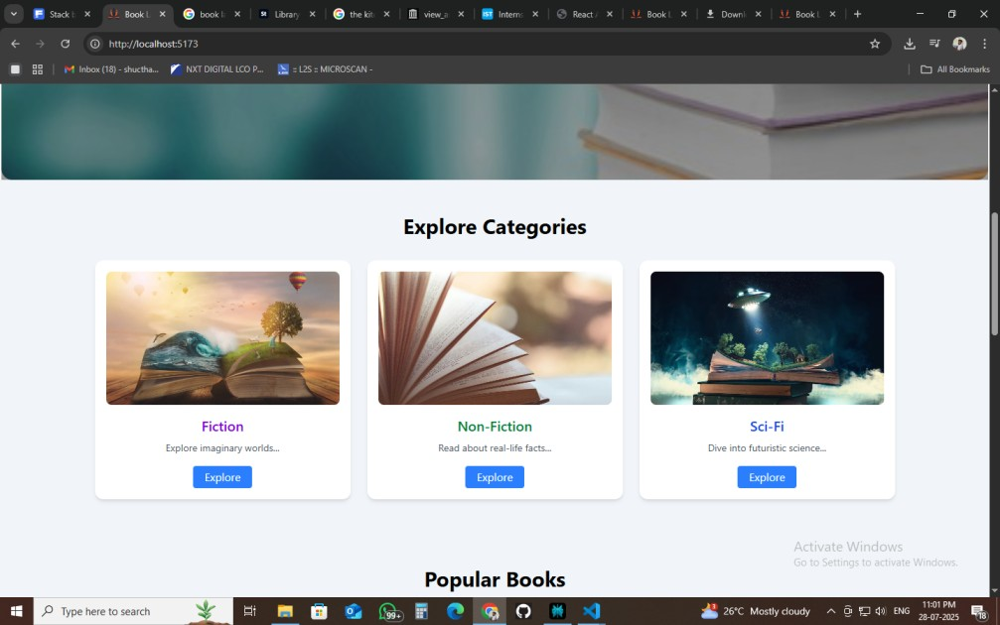
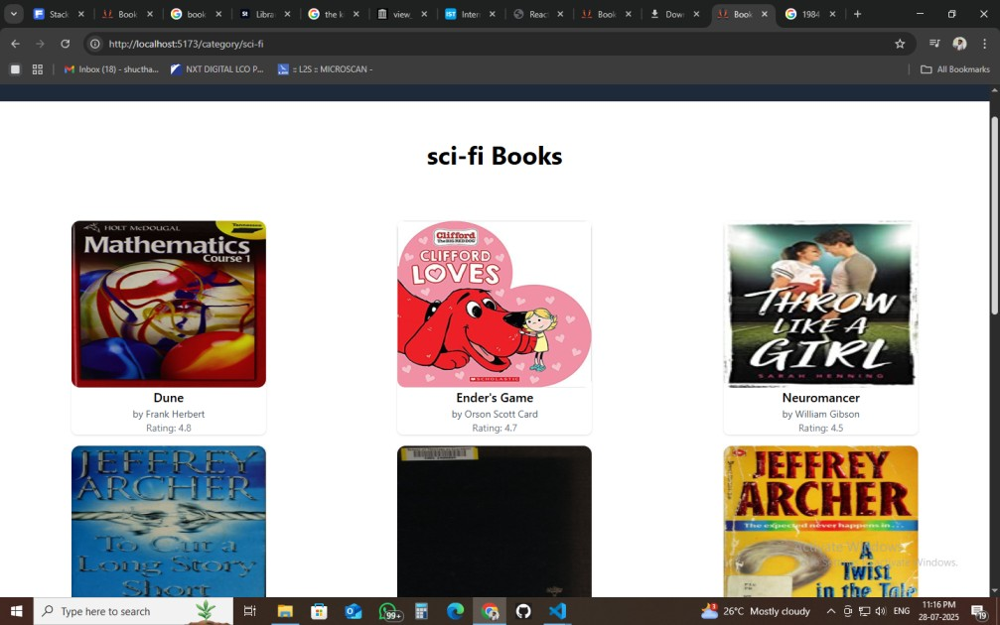

#  Online Library System

A modern web application to browse, add, and manage books, built with React and Redux.

---

##  Features

- 🔹 **Home Page**
  - Welcome message with a clean Hero section
  - Book categories displayed visually
  - Popular books listing with detail links
- 🔹 **Browse Books Page**
  - Filter books by category using dynamic routes (`/books/:category`)
  - Search books by title or author
- 🔹 **Book Details Page**
  - View detailed information (title, author, description, rating)
  - Back to Browse button
- 🔹 **Add Book Page**
  - Form to add a new book with validation
  - Redux-managed state
  - On submit, redirect to Browse page showing the new book
- 🔹 **404 Page**
  - Custom “Page Not Found” with a link back to Home

---

## 🛠 Tech Stack

- React
- React Router DOM
- Redux Toolkit
- Tailwind CSS
- Vite (for fast development)
- Dummy JSON data for books

---

##  Screenshots

###  Home Page
,
,
()

###  Browse Books Page


###  Book Details Page
,
,


###  Add Book Page


###  404 Not Found Page


1. **git hub link :**  

 https://github.com/Raj-2151-raj/Book-lab


## 🚀 How to Run the Application Locally

### 1. Clone the Repository
```bash
git clone https://github.com/Raj-2151-raj/Book-lab.git
cd Book-lab
npm install (node_module download)
npm run dev